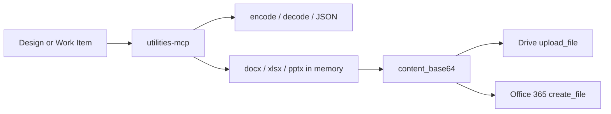

# Component diagram

```mermaid
flowchart LR
  caller[Design or Work Item] --> util[utilities-mcp]
  util --> codec[encode / decode / JSON]
  util --> office[docx / xlsx / pptx in memory]
  office --> b64[content_base64]
  b64 --> drive[Drive upload_file]
  b64 --> office365[Office 365 create_file]
```

`utilities-mcp` does not connect to the credential vault. Upload stays on the storage MCP the workflow already uses.
